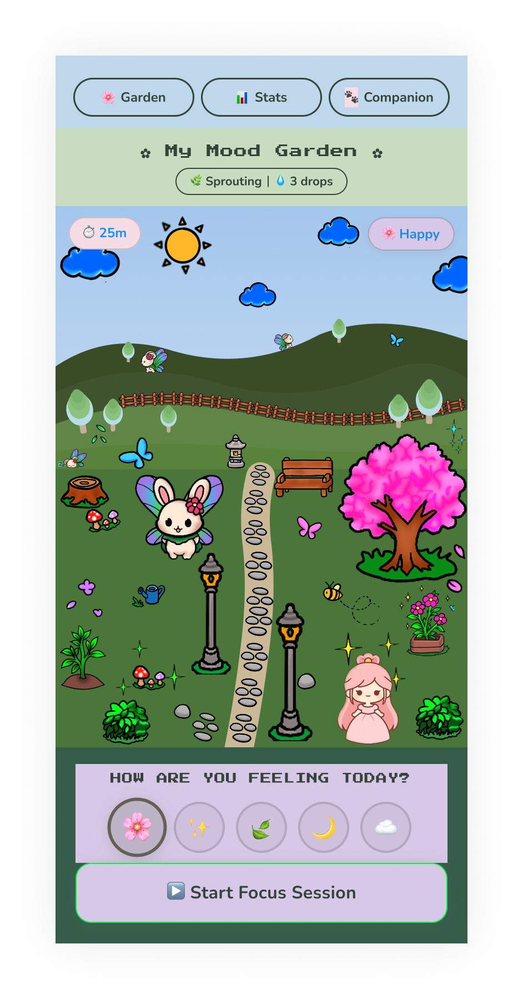
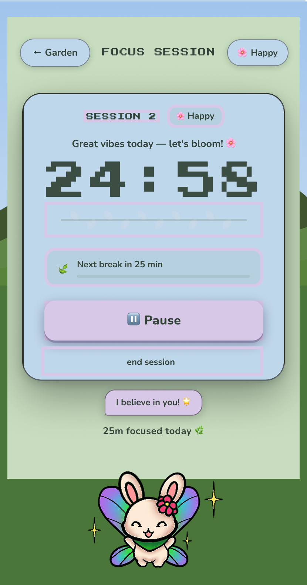
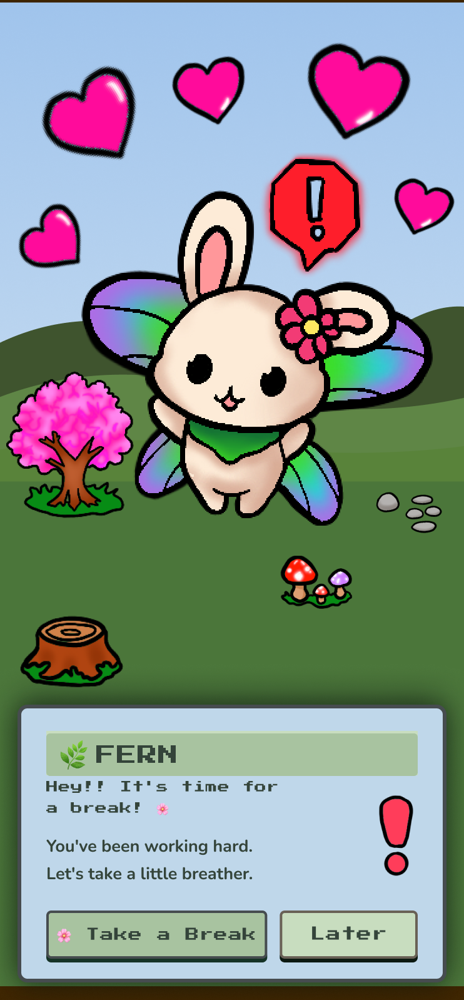
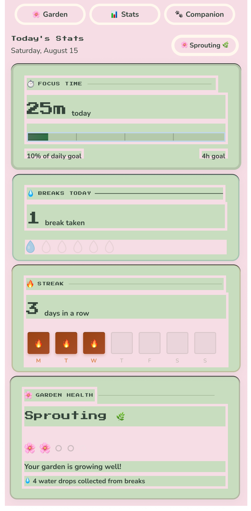
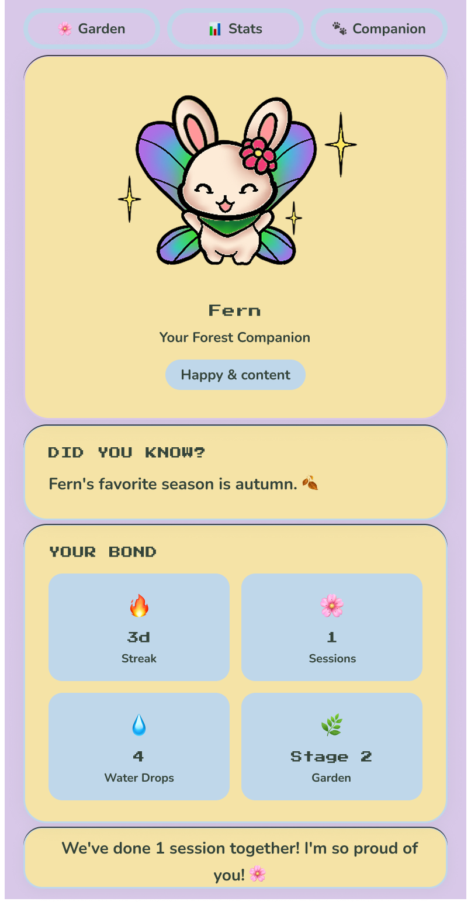
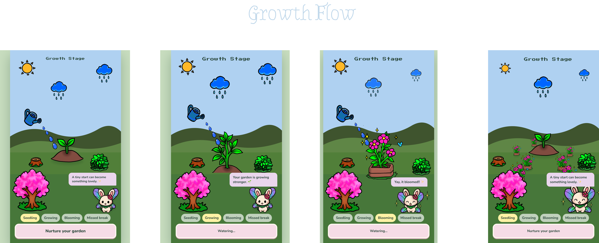
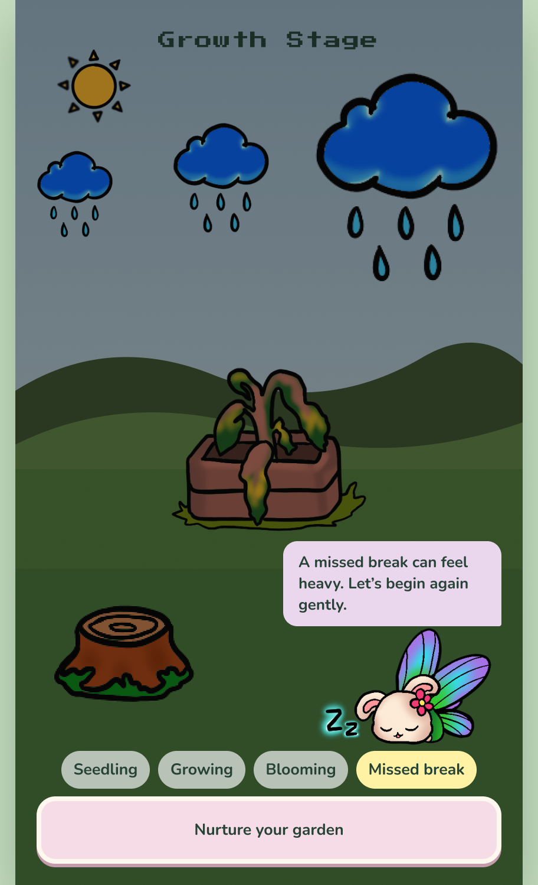
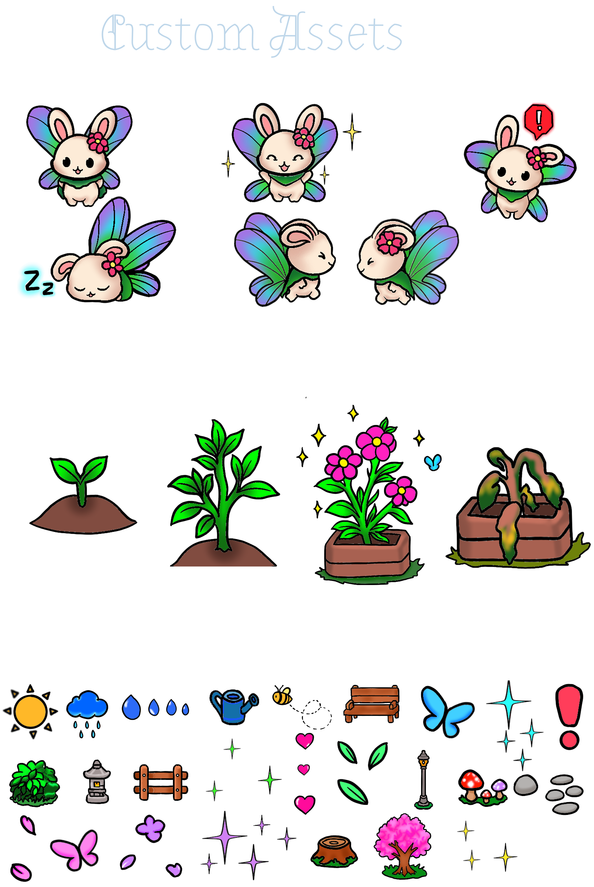
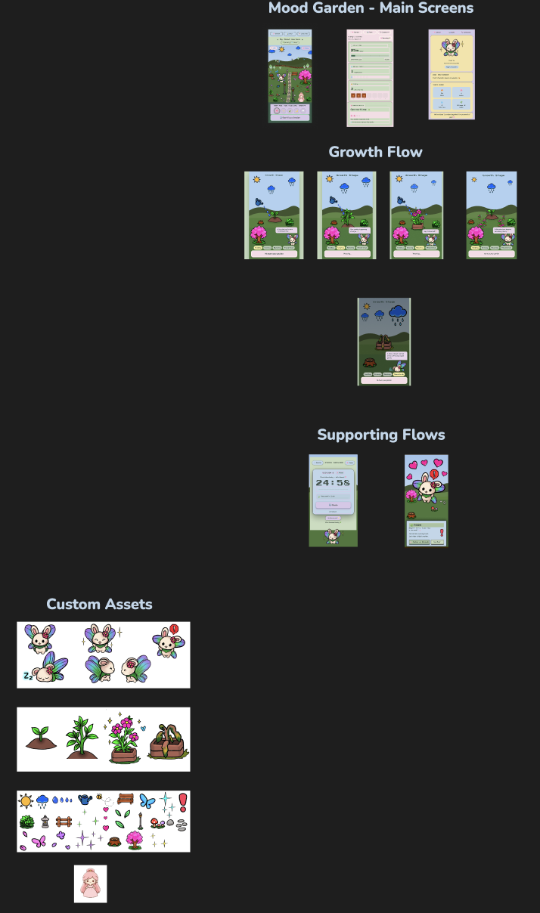

# Mood Garden 🌱

> My first UI/UX and visual design case study: a gamified focus and emotional-wellness experience that turns healthy breaks into the growth of a personal digital garden.



## Project at a Glance

| Role | Timeline | Tools |
| --- | --- | --- |
| UI/UX Designer · Visual Designer · Animation & Gamification Designer | 48-hour hackathon · ~22-hour design sprint | Figma · Procreate · GitHub |

## Overview

Mood Garden is a focus and emotional-wellness app concept that combines mood reflection, an emotional-support companion, and a Pomodoro-inspired timer.

The experience reframes breaks as part of productivity rather than an interruption. Users complete a focus session, take a recommended break, earn water droplets, and use those droplets to nurture a seedling. Over time, plants bloom and become part of a lasting personal garden.

## The Design Challenge

Many productivity tools prioritize task completion while treating breaks as optional. Mood Garden explores a more sustainable approach: helping users connect focus, emotional awareness, and rest through a gentle visual reward system.

The design goal was to create an experience that feels:

- Supportive instead of clinical
- Motivating without becoming competitive
- Calm, playful, and emotionally approachable
- Rewarding for consistency—not perfection

## My Role & Contribution

I served as the sole **Visuals, Animations & Gamification Designer** during a 48-hour hackathon and led the project’s UI/UX and visual design direction.

Over an approximately 22-hour design sprint, I was responsible for:

- Designing the high-fidelity UI/UX screens and user flows in Figma
- Establishing the visual design system: color palette, typography, component styling, layout, and visual language
- Hand-creating custom digital assets and the original companion character in Procreate
- Designing the mood-reflection, companion, focus-timer, break, garden, and statistics experiences
- Creating the garden-growth progression and missed-break/wilted visual states
- Developing the gamification system connecting focus sessions, breaks, water droplets, and plant growth
- Defining interaction and animation behavior
- Organizing the final Figma design file into a clear, portfolio-ready system of screens, states, and assets

## The Core Experience

```text
Choose a focus session
        ↓
Complete the timer
        ↓
Take a recommended break
        ↓
Earn 4 water droplets
        ↓
Use droplets to nurture a seedling
        ↓
Eventually grow a full bloom
        ↓
Automatically adds the bloom to a lasting personal garden
        ↓
Begin again with a new seedling
```

### Missed-Break State

If a user skips or repeatedly misses recommended breaks, their current plant wilts. This is designed as a gentle visual cue that rest is part of sustainable focus—not as a punishment.

## UX Flow

### 1. Garden Home


The garden is the emotional center of the experience. It gives users a calm, visual representation of their ongoing habits and makes progress feel personal.

### 2. Focus & Break Cycle

| Focus Session | Break Alert |
| --- | --- |
|  |  |

Users choose a focus duration, complete a Pomodoro-style session, and receive a clear prompt to step away and recharge. Completing the break earns four water droplets.

### 3. Mood Reflection & Support

| Stats | Emotional-Support Companion |
| --- | --- |
|  |  |

The mood and stats screens support self-reflection, while the companion brings warmth, encouragement, and personality to the product experience. The growth system provides a visual reward for sustainable focus habits: seedling → growing plant → bloom → a lasting addition to the user’s garden.

## Gamification & Growth System



The growth system turns repeated healthy choices into visual progress:

1. A new seedling represents a new growth cycle.
2. Water droplets earned through completed breaks nurture the plant.
3. The seedling progresses through growing and blooming states.
4. A fully bloomed plant becomes a permanent part of the user’s garden.
5. A new seedling appears, encouraging a sustainable ongoing rhythm.

### Alternate State: Wilted / Missed Break



The wilted state visually communicates missed care while keeping the companion and messaging supportive. It shows that the interface was designed as a system of connected user states, not just a collection of individual screens.

## Visual Design System

Mood Garden uses a soft, nature-inspired visual direction to make emotional wellness and productivity feel less intimidating.

Key design choices included:

- Calming greens, soft pastels, and warm accents to create a nurturing tone
- Friendly, expressive illustration to make the experience feel personal
- Clear visual hierarchy for timers, rewards, buttons, and progress
- Consistent component styling across focus, mood, garden, and companion flows
- Garden-based visual feedback that connects real-world habits to in-app growth

## Original Artwork & Assets



I hand-created the Mood Garden companion, plant-growth assets, and supporting visual elements in Procreate. Creating original assets allowed the app’s visual identity, gamification system, and emotional tone to feel cohesive across every screen.

## Design Process

```text
Procreate
Original companion character, garden-growth artwork, and custom visual assets
        ↓
Figma
UI/UX screens, visual system, user flows, gamification states, and portfolio-ready documentation
```
I used Procreate and Figma to develop Mood Garden from original visual assets into a cohesive, high-fidelity UI/UX case study. The final Figma file documents the product’s primary screens, growth progression, alternate missed-break state, supporting flows, and custom asset library.

## Figma Design Case Study

**[View the Mood Garden Figma Design Case Study](https://www.figma.com/design/5rBfBbgGld3HXHHLeJmXzY/Mood-Garden---Supportive-Companion---Visual-Design?node-id=0-1&t=kaUpobYLbYcQ5ng4-1)**

## Complete Design Overview



## What I Learned

Mood Garden was my first end-to-end UI/UX portfolio project. It taught me how to carry a concept from original visual asset creation through a coherent interface, gamified product flow, interactive prototype, and organized design documentation.

I also drew on three years of tattoo-artistry experience to hand-create Mood Garden’s companion, plant-growth artwork, and supporting visual assets in Procreate. That background informed the project’s expressive linework, visual storytelling, and attention to small illustrative details—helping the product feel personal rather than generic.

Most importantly, it showed me how visual design, UX decisions, and interaction feedback can work together to make a product feel emotionally thoughtful, not just functional.

## Project Context

Mood Garden originated as a collaborative 48-hour hackathon concept. This repository is a personal portfolio case study focused on my individual contributions to the UI/UX, visual design, original illustrations, animation direction, gamification system, Figma design work.
